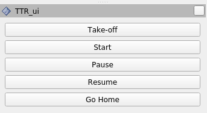

# Tandem Tree ExploreR
TTR (Tandem Tree exploreR) is a novel frontier-based exploration algorithm designed for efficient navigation in indoor and confined spaces. TTR employs a tandem tree expansion strategy: a local tree and a persistent tree, both generated using the Rapidly-exploring Random Tree algorithm (RRT). The local tree is periodically regenerated, while the persistent tree expands continuously along the mission, incorporating branches from the local tree. These structures identify key exploration points, i.e. frontiers, which are then validated, clustered, and finally screened to decide on the next goal to achieve.

# Installation
This code has been tested on Ubuntu 64-bit 20.04.6 LTS with ROS Noetic (desktop-full). For newer versions of Ubuntu use [TTR-docker](https://github.com/INTER-Robotics/TTR-docker).

### Install Dependencies
```bash
sudo apt install python3-wstool \
python3-catkin-tools \
ros-noetic-cmake-modules \
protobuf-compiler \
autoconf \
ros-noetic-geographic-msgs \
python-is-python3 \
ros-noetic-mavros-msgs \
ros-noetic-octomap-server \
ros-noetic-teleop-twist-joy
```

### Create workspace
```bash
mkdir -p <workspace_name>/src
cd <workspace_name>
catkin init
catkin config --cmake-args -DCMAKE_BUILD_TYPE=Release
```
### Install packages
Assuming you are in the workspace directory:
```bash
cd src
git clone https://github.com/INTER-Robotics/TTR.git
cd ..
wstool init . ./src/TTR/ttr_installer.rosinstall
wstool update
catkin build
```

# Usage
In a console execute the following command to start up the simulation in the indoor AT scenario and the TTR explorer:
```bash
roslaunch ttr MAV_exploration_indoor_at.launch
```

Now in the TTR ui, on RViz, press first the button "Take-off" and when the UAV has taken off press "Start" to begin the exploration, in the following image you can see the user interface:



# Citation
```
@article{TAULERROSSELLO2026105730,
  title = {Tandem Tree exploreR (TTR): A frontier-based autonomous exploration approach for indoor and confined environments},
  journal = {Robotics and Autonomous Systems},
  pages = {105730},
  year = {2026},
  issn = {0921-8890},
  doi = {https://doi.org/10.1016/j.robot.2026.105730},
  url = {https://www.sciencedirect.com/science/article/pii/S092188902600401X},
  author = {Antoni Tauler-Rossello and Emilio Garcia-Fidalgo and Francisco Bonnin-Pascual and Alberto Ortiz},
  keywords = {Exploration, Frontier, UAV, Navigation, Mapping},
  abstract = {Exploration in robotics involves navigating and mapping unknown environments and remains a challenging problem without a fully satisfactory solution. In this work, we present TTR (Tandem Tree exploreR) as a novel frontier-based exploration algorithm designed for efficient navigation in indoor and confined spaces. TTR employs a tandem tree expansion strategy: a local tree and a persistent tree, both generated using the Rapidly-exploring Random Tree algorithm (RRT). The local tree is periodically regenerated, while the persistent tree expands continuously along the mission, incorporating branches from the local tree. These structures identify key exploration points, i.e. frontiers, which are then validated, clustered, and finally screened to decide on the next goal to achieve. TTR computes a path to the chosen goal using the persistent tree structure. To assess its effectiveness, we compare our approach against three state-of-the-art solutions in various environments, as well as through real-world tests with TTR running onboard a custom-built multicopter developed specifically for this study.}
}
```
